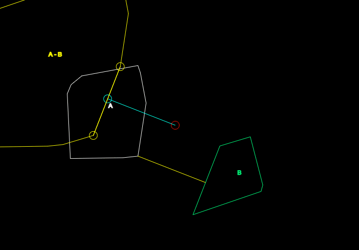

# cozyhome-distance-gjk-js


This repository houses my implementation of the Gilbert Johnson Keerthi algorithm for convex sets in two dimensions. The output of this algorithm returns the simplex used to minimize the norm of the configuration space obstacle as well as the minimized point in configuration space. 

Using this simplex, it is trivial to construct a nearest pair of vertices via barycentric coordinates. Although this pair is not necessarily continuous under rotational transformations, minimized distance is preserved. I've designed this algorithm to return as much information as possible to ensure ease of usability. As well as this, it is optionally able to exploit frame coherency by reinserting a simplex from a prior iteration.

## Example #1: Executing Distance-GJK
```js
// Here is how you would typically go about executing the DGJK:
// run DGJK by passing the two point sets in. You can (optionally) pass in a prior simplex
// from a previous frame to converge quicker for this iteration. Check dgjk.js for more details.
const query = DGJK(A,B);
// the final simplex after termination. This will be used with 'nv' to
// get a non-unique closest pair of points on each convex hull of the point sets.
const splx = query.splx; 	/* type: GJKSimplex2D */
// the minimized vector in A - B returned by the DGJK.
const nv = query.nv; 	/* type: vec2 */
// the norm of nv is the metric (euclidean) distance between the two
// convex sets.
const dist = norm2(nv);	/* type: Number */
// the pairwise tuple of (non-unique) closest vertices that contribute
// to the minimized norm of A - B.
const pair = DGJK_CLOSEST(splx,nv); /* type: {a:vec2, b:vec2 } */
// dereferencing the two points computed in DGJK_CLOSEST:
const pa = pair.a; 
const pb = pair.b;
```
## Example #2: Constructing a Compatible Polygon
```js
// This is an example of a generating function you could use
// to construct polygonal objects that are compatible with DGJK:
const CONVEX_POLYGON=(pts)=>{
// get the convex hull of an arbitary point set in R^2 using any
// convex hull algorithm (not necessarily required, just minimizes input set)
	const gon = QUICKHULL(pts);
	const hull = gon.hull;

// compute centroid to then use as origin for object space
// representation (not necessarily required, just makes transformations easier)
	const centroid = zero2();
	for(let i=0;i<hull.length;i++) {
		centroid._x += hull[i]._x;
		centroid._y += hull[i]._y;
	}
// centroid is a uniform distribution of weight along
// all contributing points
	centroid._x /= hull.length;
	centroid._y /= hull.length;		
// reconfigure polygon to be w.r.t the centroid of its 
// vertices. This essentially allows us to apply linear transformations
// from the viewpoint of the polygon's centroid.
	for(let i=0;i<hull.length;i++) {
		hull[i]._x = hull[i]._x - centroid._x;
		hull[i]._y = hull[i]._y - centroid._y;
	}
	gon.mat = new Matrix3x3();                          // internal matrix state
	gon.mat.translate(centroid._x, centroid._y);		// translate matrix to centroid
// REQUIRED DEPENDENCIES FOR DGJK:
// l2w() and l2w_iv() are REQUIRED for DGJK to function. These must
// be part of your input polygons in order for DGJK to work!
	gon.l2w =()=> { return gon.mat.get(); }				// local to world matrix accessor
	gon.l2w_iv=()=> { return mInverse(gon.l2w()); }	            // world to local matrix accessor
	gon.pts =()=> { return gon.hull; }				// point set accessor
// helper method for center calculation (not necessarily required, just makes origins easier to get)
	gon.origin=()=> {
		const m = gon.l2w();
		const w = m[8];
		return new vec2(w*m[6],w*m[7]);
	}
	return gon;
}
```
## A Semi-Indepth Explanation of the GJK:
I wrote an article on my CIMS page documenting the GJK's internal state. [Check it out!](https://cs.nyu.edu/~djc624/hobby/dgjk/index.html)